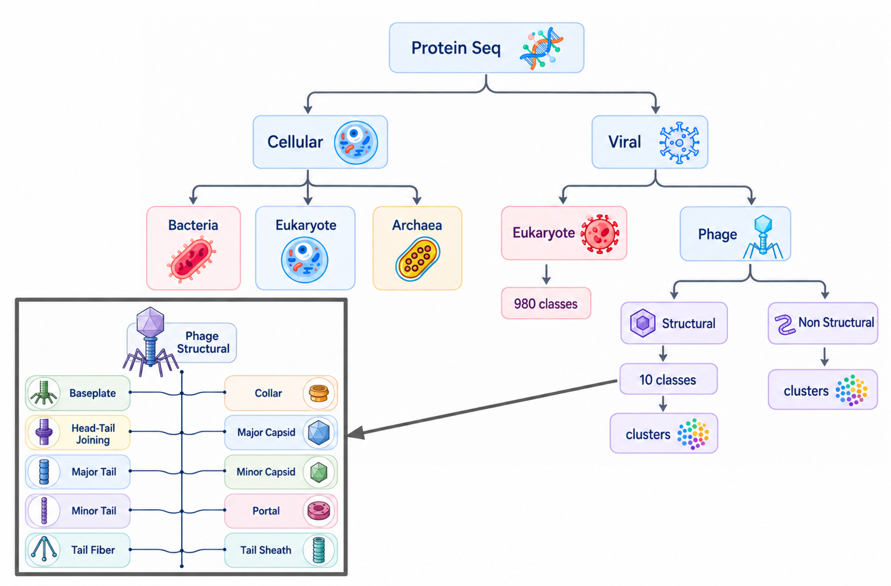
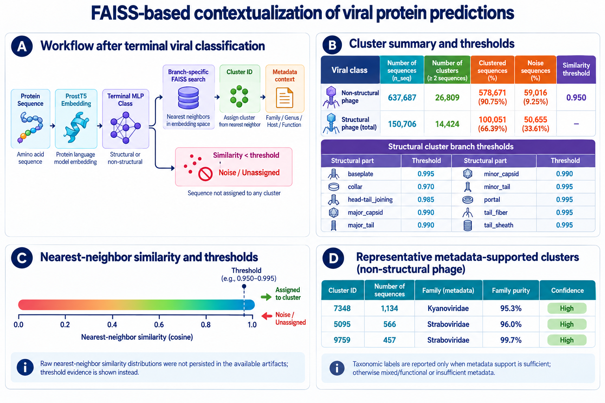
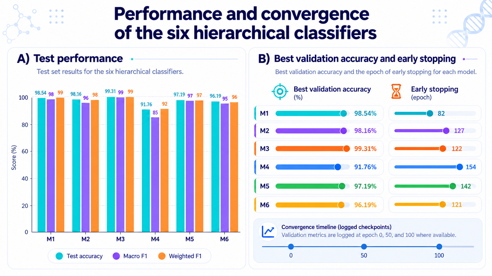
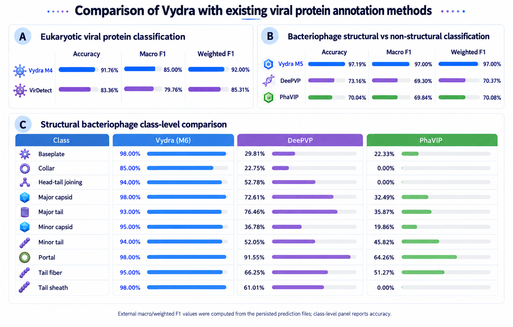
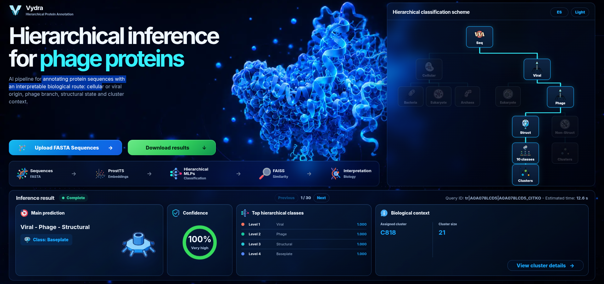

<div align="center">
  <p>
    <a href="README.md"></a>
    <a href="README.es.md"></a>
  </p>
  
  <h1>Vydra</h1>
  <p><strong>Hierarchical protein classification and biological contextualization with ProstT5, MLPs, and FAISS.</strong></p>
  <p>
    
    
    
    
  </p>
</div>

Vydra takes a protein sequence through a cascade of six classifiers. It separates
cellular from viral proteins, distinguishes bacteriophages from eukaryotic
viruses, and identifies structural phage proteins and their functional class.
For phage predictions, it also searches reference neighborhoods to provide
interpretable biological context.

> **Status:** active research project. FAISS assignments provide similarity-based
> context and should not be interpreted as direct taxonomic classification of a
> query sequence.



## What Vydra predicts

All six classifiers share a 1,024-dimensional ProstT5 embedding:

| Model | Decision |
|---|---|
| M1 | Viral or cellular |
| M2 | Bacteria, Archaea, or Eukaryota |
| M3 | Bacteriophage or eukaryotic virus |
| M4 | One of 978 eukaryotic-virus classes |
| M5 | Structural or non-structural phage protein |
| M6 | One of 10 structural phage classes |

The structural classes are `baseplate`, `collar`, `head_tail_joining`,
`major_capsid`, `major_tail`, `minor_capsid`, `minor_tail`, `portal`,
`tail_fiber`, and `tail_sheath`.

## Quick start

### 1. Clone and install

```bash
git clone https://github.com/Maxdesigna7x/Vydra.git
cd Vydra
conda env create -f environment.yml
conda activate vydra
```

### 2. Download the large artifacts

The MLP weights are included in the repository. The FAISS prototype banks are
published separately in GitHub Releases because together they occupy about 1.6
GB:

```bash
./vydra download-artifacts
```

Raw protein sequences also require ProstT5. Downloading it once stores a local
copy inside the bundle for later offline use:

```bash
./vydra download-model
./vydra doctor
```

For a private clone, `download-artifacts` automatically uses an authenticated
GitHub CLI session. Run `gh auth login` first when needed.

### 3. Run a prediction

```bash
./vydra predict --seq "MSTNPKPQRKTKRNTNRRPQDVKFPGGGQIVGGVYLLPRRGPRLG"
```

FASTA input and CSV output:

```bash
./vydra predict --fasta proteins.fasta --format csv --output predictions.csv
```

Read FASTA from a pipe:

```bash
cat proteins.fasta | ./vydra predict --stdin --format jsonl
```

Use existing 1,024-dimensional ProstT5 embeddings without loading the base
model:

```bash
./vydra predict --embedding embeddings.npy --offline --format json
```

The CLI supports `table`, `json`, `jsonl`, and `csv` output. It detects CUDA
automatically, while `--device cpu` and `--device cuda` provide explicit control.

## How it works

```text
Protein sequence
      │
      ▼
ProstT5 → 1,024-dimensional embedding
      │
      ▼
M1: cellular ─────────────► M2: Bacteria / Archaea / Eukaryota
 │
 └── viral ───────────────► M3: eukaryotic virus / bacteriophage
                              │                    │
                              ▼                    ▼
                         M4: 978 classes     M5: structural / non-structural
                                                   │
                                                   ▼
                                             M6: 10 classes
                                                   │
                                                   ▼
                                      FAISS + biological context
```

Sequences longer than 2,048 amino acids are split into overlapping windows and
their embeddings are averaged. The final search uses inner product over
normalized vectors and class-specific prototype banks.



## Experimental performance

Across the internal test sets used during development, the six local classifier
heads achieved accuracies between 91.76% and 99.31%. These values describe each
head under its own evaluation split; they are not a claim of end-to-end accuracy
on every external distribution.



The project also compares Vydra with established protein-annotation approaches.
Interpret this figure together with the evaluation protocol and dataset scope;
different tools may solve partially different tasks.



## Web interface

The included FastAPI application provides FASTA upload, hierarchical results,
confidence scores, cluster context, and downloadable predictions through a
visual interface.



Run it locally after downloading the inference artifacts:

```bash
cd Vydra_Docker_HF
uvicorn app:app --host 0.0.0.0 --port 7860
```

Then open `http://localhost:7860`.

## Offline execution

After `download-artifacts` and `download-model`, inference can run without
network access:

```bash
./vydra predict --offline --fasta proteins.fasta
```

You may also point Vydra to an existing local ProstT5 installation:

```bash
export VYDRA_PROSTT5_PATH=/local/path/to/ProstT5
./vydra predict --offline --fasta proteins.fasta
```

## Repository layout

```text
Vydra/
├── vydra                         # CLI launcher
├── Vydra_Docker_HF/
│   ├── vydra_cli.py              # commands and output formats
│   ├── inference_gradio.py       # inference engine
│   ├── app.py                    # FastAPI API and web application
│   ├── models/mlp_weights/       # six MLP heads
│   ├── artifacts/                # labels, metadata, downloaded banks
│   └── web/                      # frontend
├── docs/images/                  # project figures
├── environment.yml
└── requirements.txt
```

Raw datasets, training embeddings, research notebooks, and temporary
checkpoints are intentionally excluded from the lightweight GitHub distribution.

## Embedding format

The CLI accepts NumPy matrices with shape `(n, 1024)` or PyTorch dictionaries.
The nested format used by the project is:

```python
{
    "class_name": {
        "sequence_id": torch.Tensor(shape=(1024,))
    }
}
```

## Limitations

- Performance depends on the coverage and distribution of the reference data.
- High MLP confidence does not replace independent biological validation.
- A cluster label summarizes known neighbors; it does not establish taxonomy.
- ProstT5 and the prototype banks require several GB of storage.
- CPU inference works, but a CUDA GPU substantially reduces embedding time.

## Documentation

- [CLI guide](Vydra_Docker_HF/CLI.md)
- [Web service documentation](Vydra_Docker_HF/README.md)
- [Versión en español](README.es.md)

## Citation

Vydra is part of an ongoing thesis project. A formal citation will be added when
the manuscript becomes available. Until then, please link to this repository
and record the commit used in your analysis.
